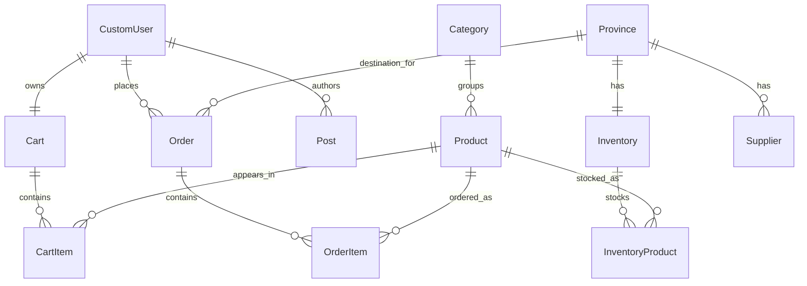

# 03 Data Model Report

## Scope note

This report reflects the current model layer in the workspace and cross-checks it against migration history where useful. Some inconsistencies are historical rather than current.

## Model inventory by app

### `accounts`

- `CustomUser`

### `Shop`

- `Product`
- `Province`
- `Inventory`
- `InventoryProduct`
- `Supplier`
- `Category`
- `Cart`
- `CartItem`
- `Order`
- `OrderItem`

### `blog`

- `Post`

## Important models

### `accounts.CustomUser`

Purpose:

- custom authentication identity using phone number instead of username/email

Key fields:

- `phone`
- `email`
- `address`
- inherited auth fields from `AbstractUser`

Important relationships:

- one-to-one with `Shop.Cart` through the cart model
- referenced by `Shop.Order`
- referenced by `blog.Post.author`

Risky design choices:

- `email` is a `CharField`, not an `EmailField`
- authentication behavior depends on a custom manager and `USERNAME_FIELD = "phone"`
- a post-save signal in `accounts/models.py` auto-creates carts, which hides business side effects

### `Shop.Product`

Purpose:

- sellable catalog item

Key fields:

- `name`
- `description`
- `price`
- `image`
- `category`

Important relationships:

- belongs to `Category`
- linked to stock through `InventoryProduct`
- referenced by `CartItem`
- referenced by `OrderItem`

Risky design choices:

- no obvious SKU or slug field
- no explicit stock field on the product, which is correct for multi-inventory design but increases join complexity

### `Shop.Category`

Purpose:

- product grouping for storefront navigation

Key fields:

- `name`
- `image`

Important relationships:

- one category to many products

Risky design choices:

- no uniqueness constraint on name
- images add media management needs for a portfolio repo

### `Shop.Province`

Purpose:

- geographical region used for inventory and order routing

Key fields:

- `name`

Important relationships:

- one province to one `Inventory`
- one province to many `Order`
- one province to many `Supplier`

Risky design choices:

- province naming implies country-specific assumptions
- no normalization beyond a name field

### `Shop.Inventory`

Purpose:

- physical inventory location for a province

Key fields:

- `province`
- `address`
- `phone`

Important relationships:

- one-to-one with `Province`
- one-to-many with `InventoryProduct`

Risky design choices:

- province inventory is one-per-province, which may be too rigid for real operations

### `Shop.InventoryProduct`

Purpose:

- stock join table between products and inventory locations

Key fields:

- `inventory`
- `product`
- `quantity`

Important relationships:

- foreign key to `Inventory`
- foreign key to `Product`

Risky design choices:

- quantity is central to order correctness, so any bypass around validation would be dangerous
- current model is safer than the older decimal-quantity approach implied by the repo history, but still depends on service-layer discipline

### `Shop.Supplier`

Purpose:

- supplier contact record, likely for back-office use only

Key fields:

- `name`
- `province`
- `phone`
- `email`
- `address`

Important relationships:

- foreign key to `Province`

Risky design choices:

- appears weakly integrated with actual procurement logic
- supplier data currently looks informational, not operational

### `Shop.Cart`

Purpose:

- customer shopping cart

Key fields:

- `user`

Important relationships:

- one-to-one with `CustomUser`
- one-to-many with `CartItem`

Risky design choices:

- lifecycle depends on a user-creation signal rather than explicit application flow

### `Shop.CartItem`

Purpose:

- product line inside a cart

Key fields:

- `cart`
- `product`
- `quantity`

Important relationships:

- foreign key to `Cart`
- foreign key to `Product`

Risky design choices:

- business correctness depends on the unique constraint and service merge behavior
- the current model has a good uniqueness constraint, but older code could have relied on view-level merging

### `Shop.Order`

Purpose:

- order header created from selected cart items

Key fields:

- `user`
- `is_send`
- `province`
- `address`

Important relationships:

- foreign key to `CustomUser`
- foreign key to `Province`
- one-to-many with `OrderItem`

Risky design choices:

- `is_send` is a very thin order-state model
- there is no payment state, cancellation state, or immutable audit trail

### `Shop.OrderItem`

Purpose:

- purchased product line within an order

Key fields:

- `order`
- `product`
- `quantity`

Important relationships:

- foreign key to `Order`
- foreign key to `Product`

Risky design choices:

- there is no captured per-line sale price field
- order history therefore depends on mutable `Product.price`

This is a notable business-model weakness if historical order totals ever matter.

### `blog.Post`

Purpose:

- simple content/news/blog entry

Key fields:

- `title`
- `author`
- `summaries`
- `body`

Important relationships:

- foreign key to `CustomUser`

Risky design choices:

- field name `summaries` is awkward for a single summary value
- blog is not deeply integrated into the rest of the domain

## Entity relationship summary

Text summary of the current domain:

- a `CustomUser` owns one `Cart`
- a `Cart` contains many `CartItem`
- a `CartItem` points to one `Product`
- a `Product` belongs to one `Category`
- a `Product` can exist in many `Inventory` locations through `InventoryProduct`
- an `Inventory` belongs to one `Province`
- a `Supplier` belongs to one `Province`
- an `Order` belongs to one `CustomUser` and one `Province`
- an `Order` contains many `OrderItem`
- an `OrderItem` points to one `Product`

## Mermaid ER diagram

## Central vs peripheral models

### Central models

- `CustomUser`
- `Product`
- `Category`
- `Province`
- `Inventory`
- `InventoryProduct`
- `Cart`
- `CartItem`
- `Order`
- `OrderItem`

These define the real system behavior.

### Peripheral models

- `Supplier`
- `Post`

These matter, but they do not drive the main transaction flow.

## Confusing or inconsistent names

- `is_send`
  - grammatically awkward; likely intended as “is sent”
- `summaries`
  - plural field name for singular content
- `logedin`
  - URL/view naming typo elsewhere in the project
- `InventoryProduct`
  - acceptable, but verbose and slightly awkward compared with names like `StockItem`

## Migration history observations

Important migration history signals:

- `Shop/migrations/0004_form.py` created a `Form` model with misspelled fields such as `skils`
- `Shop/migrations/0006_city_province_delete_form_city_province.py` deleted that model and introduced location models
- `accounts` originally carried more geographic fields directly on the user model and later removed them
- later `Shop` migrations show a transition toward more explicit and safer cart/order logic

## Data model assessment

The current data model is understandable and good enough for a small portfolio app, but it is not fully mature.

Best parts:

- clear commerce-oriented core
- proper join model for stock by inventory
- current cart/order quantity fields are integer-based
- useful uniqueness constraints on line-item models

Weakest parts:

- thin order-state modeling
- hidden cart creation side effect
- no immutable order pricing snapshot
- naming residue from the project’s earlier iterations
