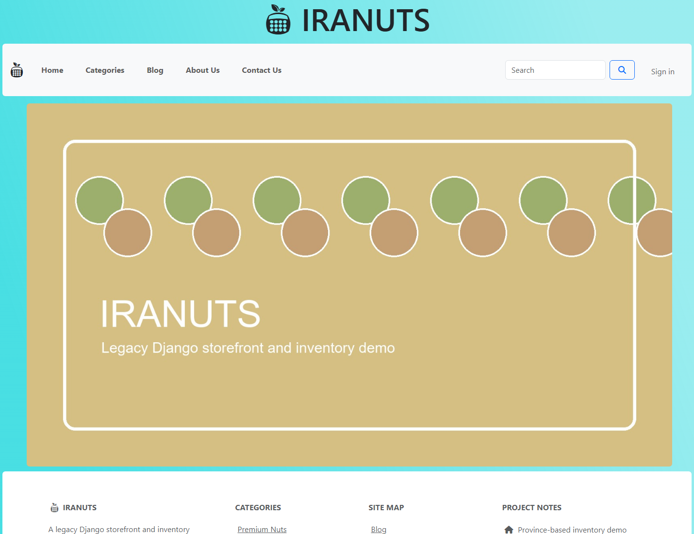
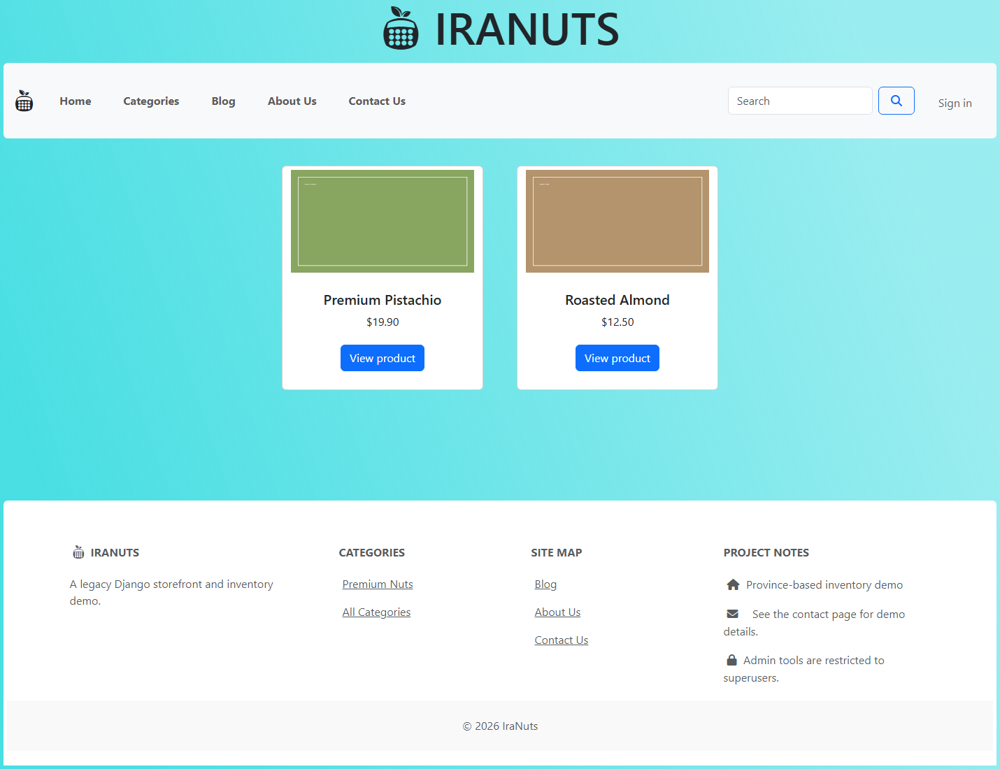
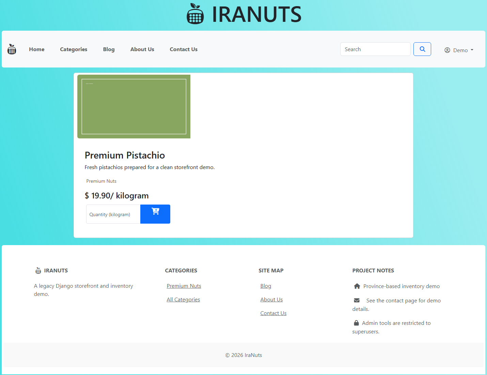
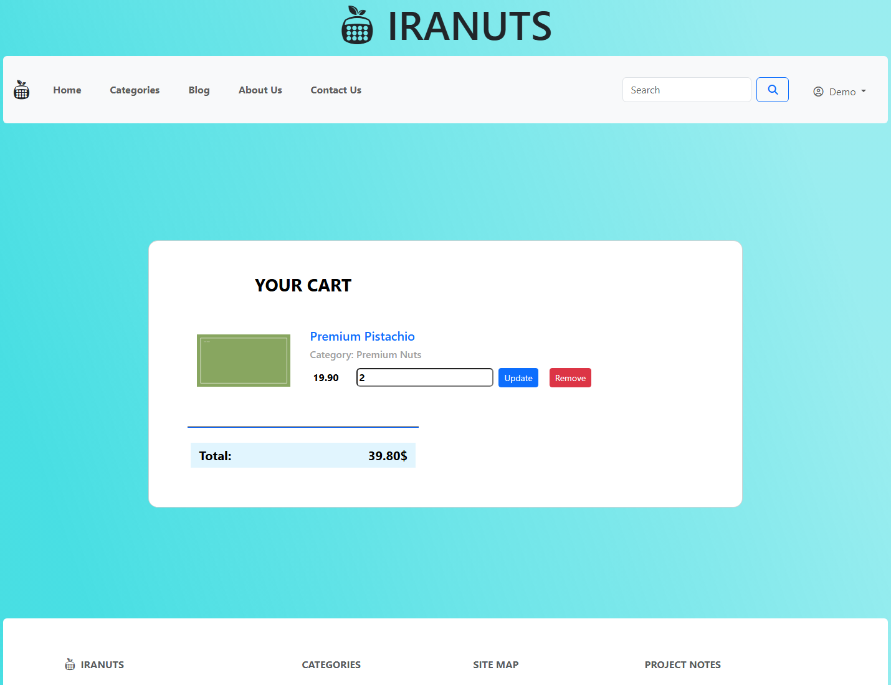
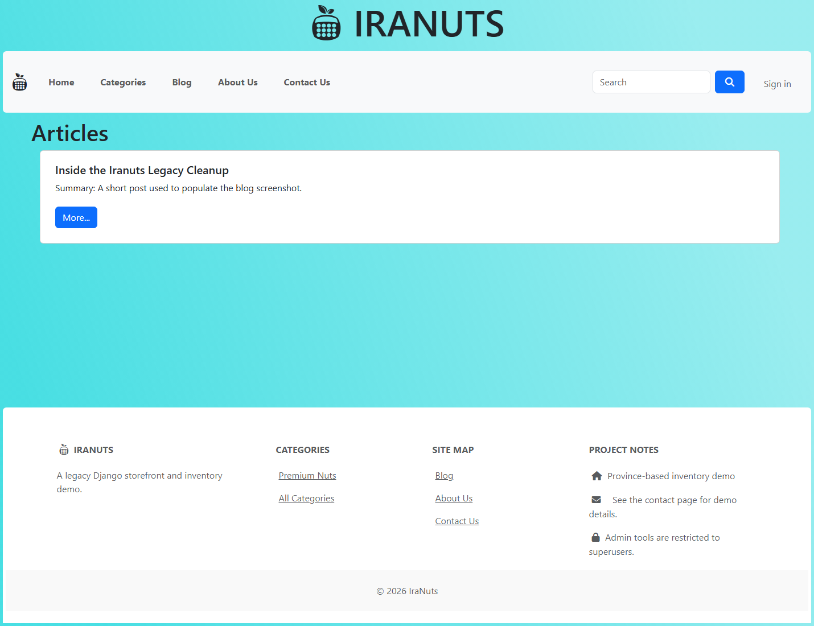
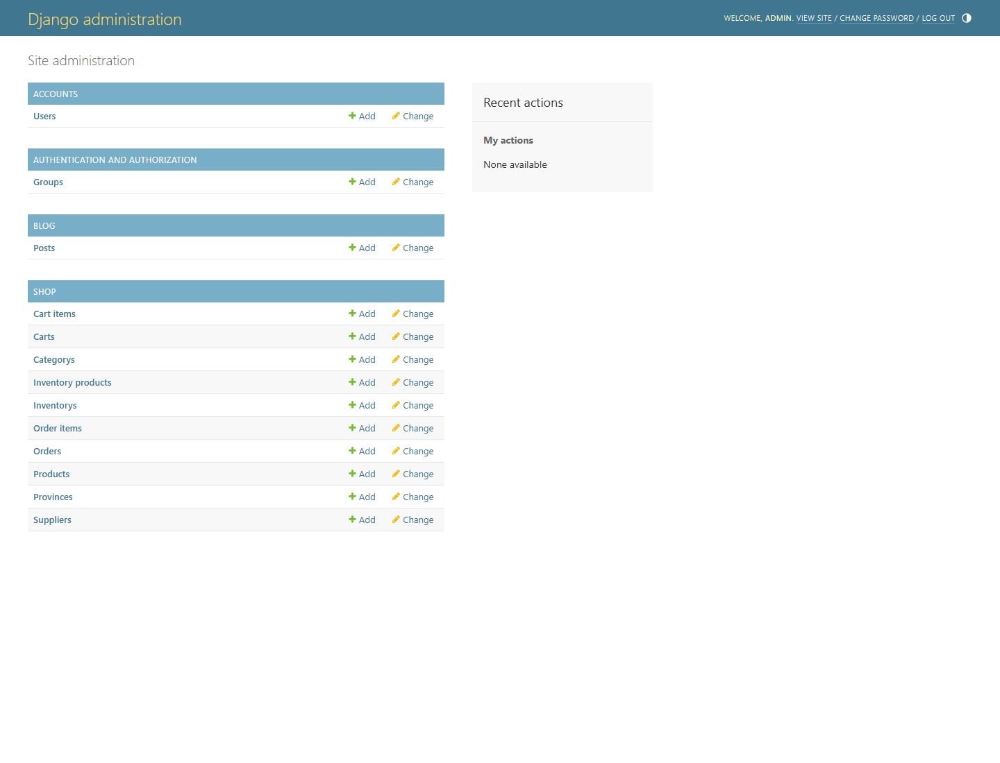

# Screenshot Gallery

These screenshots were captured from a local run of the application on a documentation-only branch.

Notes:

- the app was started locally through the existing `RUN_ME.ps1` workflow
- a small local demo dataset was created only to make the storefront, cart, blog, and admin pages representative
- the generated local database and media used for capture are not committed to the repository

## Home

Shows the public landing page with the shared navigation and footer.

## Product list

Shows a populated storefront listing with two sample products.

## Product detail

Shows a logged-in product detail view with the add-to-cart form visible.

## Cart

Shows the customer cart flow after login with a sample line item and quantity controls.

## Blog

Shows the blog landing page with a seeded sample post.

## Admin

Shows the built-in Django admin after login as a local superuser, including the cleaned model registrations.

